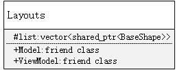
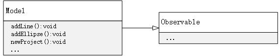

# Model

## 模块概述

​	Model层是MVVM模式的底层，管理数据以及提供一些操作数据的方法。同时它也是观察者模式中的被观察者，在数据变化后负责发送通知给上层。本工程Model层是建立在一系列数据结构上的数据操作层，分为两个主要的部分：图层管理类和形状管理类。


## Layouts类

​	Layouts类维护了一条图层向量表，同时将Model和ViewModel设为友元以方便访问。




## Model类

### Model类概述

​	Model类作为观察者模式中的被观察者，继承了Obervable类；作为MVVM模式的底层，提供了一系列操作数据的接口，是ViewModel层命令的直接调用对象。



### 接口说明

添加直线

```cpp
void addLine(double, double, double, double, double, double)
```

添加椭圆

```cpp
void addEllipse(double, double, double, double)
```

添加矩形

```cpp
void addRect(double, double, double, double)
```

添加图片

```cpp
void addImage(string)
```

添加文本

```cpp
void addText(int, int, string)
```

图层格式转换

```cpp
void LayoutTransform(int, int)
```

图层顺序调整

```cpp
void LayoutOrderChange(int, int, int = 0)
```

删除图层

```cpp
void DeleteLayout(int)
```

清除操作记录

```cpp
void clearDoneEvent()
```

添加操作记录

```cpp
void addDoneEvent(int, int, shared_ptr<BaseShape>, shared_ptr<BaseShape>, int)
```

添加形状基类

```cpp
void addBaseShape(vector<shared_ptr<BaseShape>>, shared_ptr<BaseShape>)
```

重做

```cpp
void redo()
```

撤销

```cpp
void undo()
```

新建工程

```cpp
void newProject(int, int)
```

保存工程

```cpp
void saveProject(string)
```

打开工程

```cpp
void loadProject(string)
```

获取画布宽

```cpp
int getCanvasWidth()
```

获取画布高

```cpp
int getCanvasHeight()
```

设置笔刷

```cpp
void SetPen(Pen)
```

设置笔刷颜色

```cpp
void SetPenColor(unsigned char, unsigned char, unsigned char)
```

设置笔刷大小

```cpp
void SetPenWidth(int)
```

设置笔刷模式

```cpp
void SetPenStyle(int)
```

设置填充色

```cpp
void SetBrushColor(unsigned char, unsigned char, unsigned char)
```

设置填充模式

```cpp
void SetBrushStyle(int)
```

工程为空

```cpp
bool isProjectEmpty()
```

获取填充笔刷

```cpp
const Brush* GetBrush()
```

获取笔刷

```cpp
const Pen* GetPen()
```

获取图层表

```cpp
const Layouts* GetLayouts()
```


