## View

​	View模块主要使用Qt5实现，采用状态机的方式进行状态管理与转换。

​	View包括4个窗体类(*MainWindow* , *ImageWidget* , *ConvolutionDialog* , *NewCanvasDialog*)、1个状态基类(*BaseState*)、13个状态类、1个状态通用操作类(*StateCommonAction*)与1个状态管理类(*StateManager*)。

### UI整体功能

1. SplashScreen

   打开程序后，会首先显示2秒欢迎界面

   

2. Wizard 

   欢迎界面之后，会显示向导窗口与主窗口

   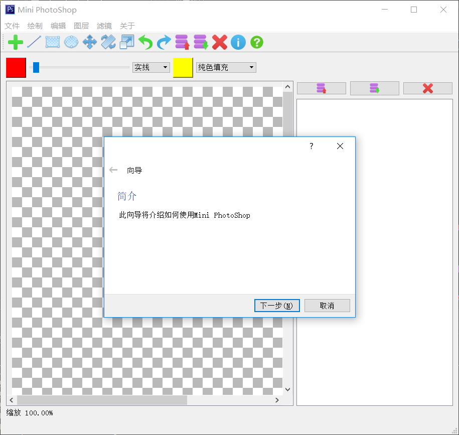

3. MainWindow
  主窗口中心为主绘图区域，最上方为菜单栏，菜单栏下方为快捷工具栏。
  快捷工具栏下方为描边与填充设置区，从左至右依次为：描边颜色设置、描边宽度设置、描边线型设置、填充颜色设置、填充方式设置。
  窗口下方为状态栏，显示缩放与操作提示。
  窗口右侧为图层列表。
  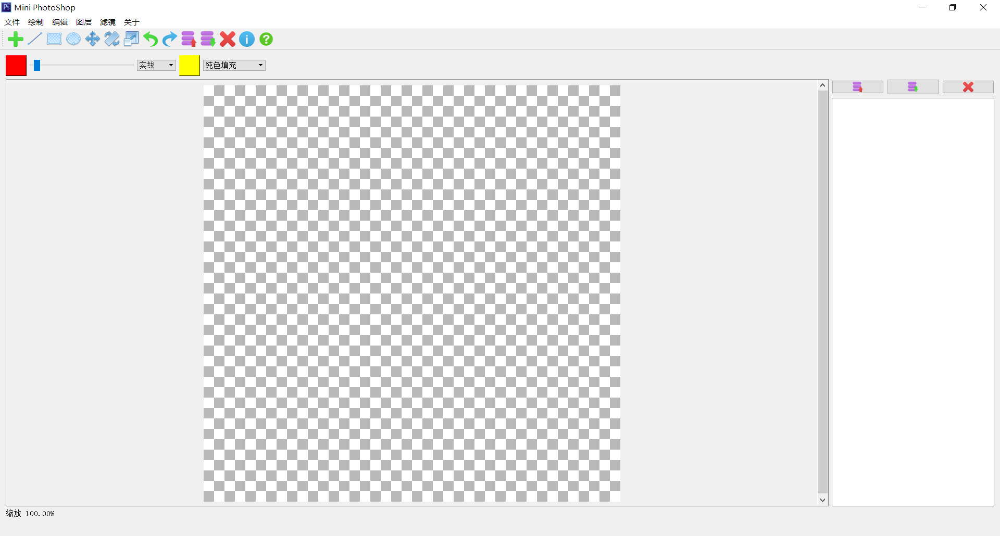

4. Buttons & Pop Menus

   将鼠标移至画布并滚动鼠标滚轮可以缩放画布，在画布以及图层列表上单击鼠标右键可以显示弹出式菜单。

   单击快捷工具栏或菜单栏可以切换工具或执行操作，图层列表上方三个按键的功能分别为上移当前图层、下移当前图层与删除当前图层。
   画布上的弹出式菜单
   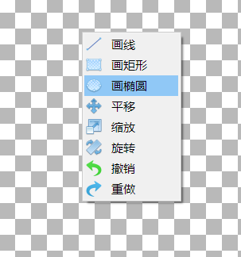
   图层列表中的弹出式菜单
   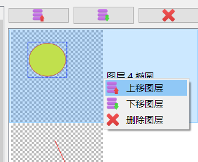
   可浮动的快捷工具栏
   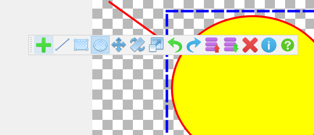
   画布的缩放功能
   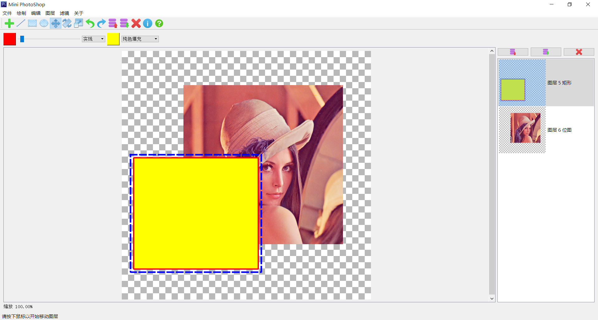
   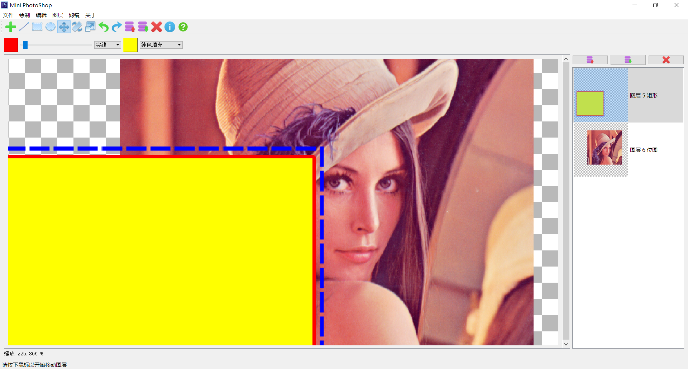
   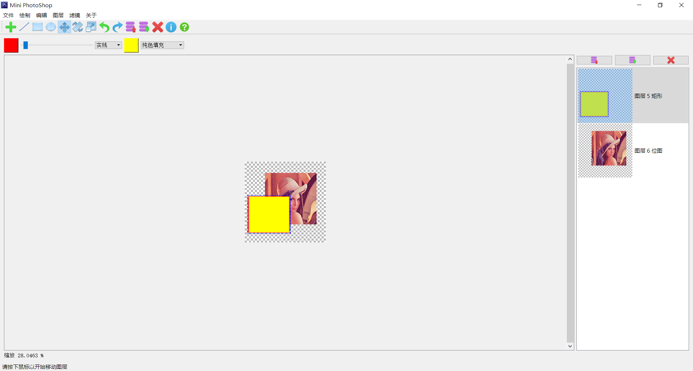
5. Other Windows
  前景色与背景色设置窗口
   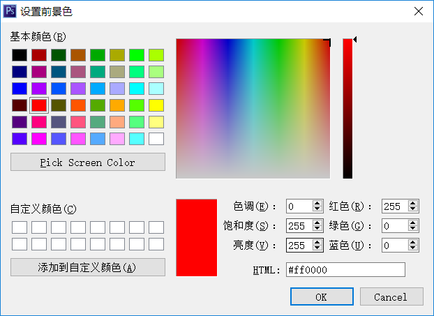
  新建工程窗口
  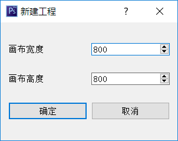
   卷积核设置窗口
  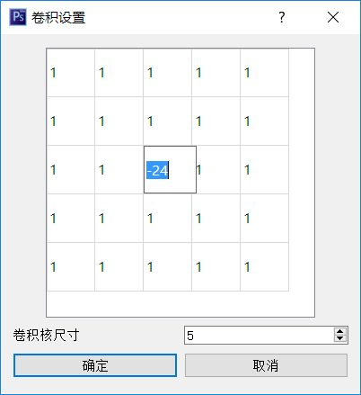

### MainWindow类

​	*MainWindow*类是程序的主窗口，也是View模块与其他部分对接的类。有一些设置命令的函数，并且通过指针绑定了ViewModel层的displayImage用于显示。另外还有一些槽函数用于与其他控件通信。通过通知的方式接受ViewModel的消息以同步数据。在按键被按下时调用*StateManager*来处理事件并改变状态。通过ViewModel层绑定了Model中的*pen*和*brush*变量，并且将变量传递给了*MainDisplayWidget*控件。

### ImageWidget类

​	*ImageWidget*类是主窗口中用于显示的显示区域，负责将ViewModel计算好的displayImage显示在窗口上，并且接受用户的鼠标操作事件，调用*StateManager*来处理事件并改变状态。

### ConvolutionDialog类

​	*ConvolutionDialog*类是用于设置卷积核的窗口，该类有一个静态成员函数`static Params GetConvolutionCore(QWidget*,int)`，用于设置卷积核。调用该函数后，会弹出一个阻塞窗口，当该窗口被关闭时函数返回，并且用*Params*类返回结果。

### NewCanvasDialog类

​	*NewCanvasDialog*类是用于设置画布尺寸的窗口，该类有一个静态成员`static Params GetCanvasSize(QWidget *);`。调用该函数后，会弹出一个阻塞式窗口，当该窗口被关闭时函数返回，并且用*Params*类返回结果。

​	

